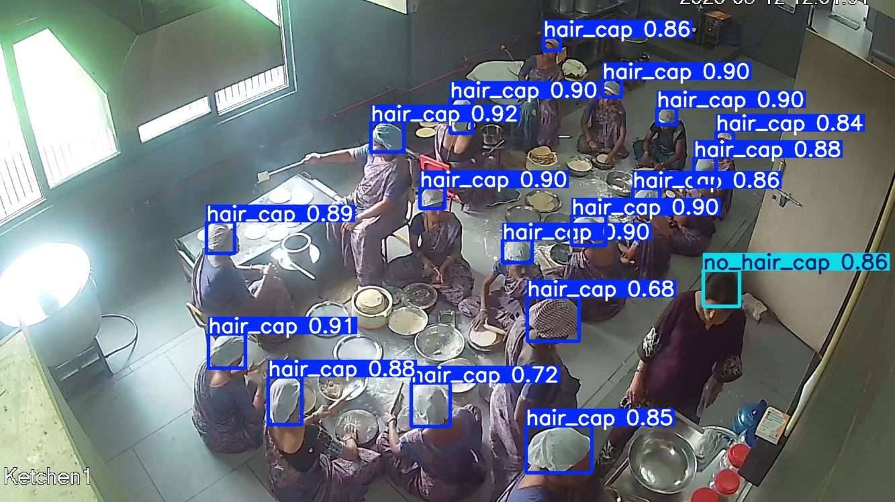
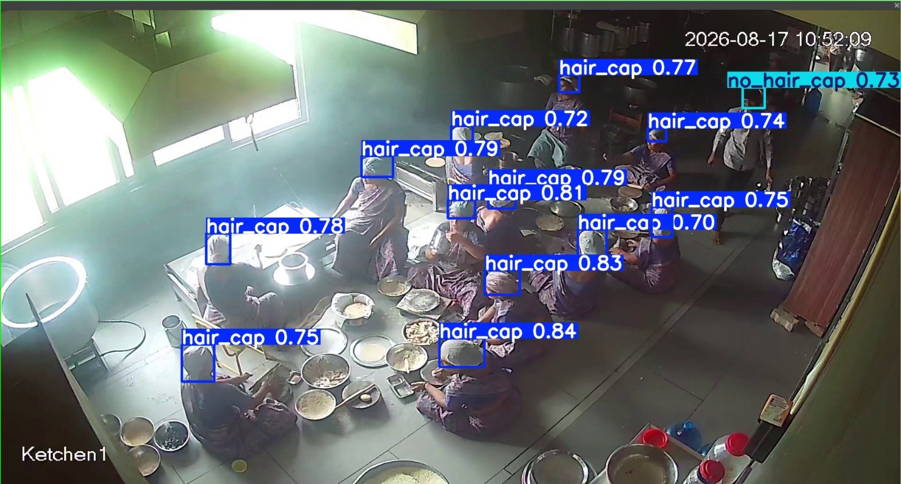

# 🍽️ Canteen Hygiene Detection — Hair Cap Compliance (YOLOv8)

A real-time object detection system that monitors canteen/kitchen staff compliance by detecting whether workers are wearing **hair caps** using a custom-trained YOLOv8 model on CCTV footage.

---

## 📌 Project Overview

In food service environments, wearing hair caps is mandatory for hygiene. This project automates compliance monitoring using computer vision — eliminating the need for manual inspection.

**Model Output Classes:**
- ✅ `haircap` — Worker is wearing a hair cap
- ❌ `no_haircap` — Worker is NOT wearing a hair cap

---

## 🎯 Demo

| Haircap Detected ✅ | No Haircap ❌ |
|---|---|
|  |  |


---

## 🗂️ Project Structure

```
school/
├── best.pt                          # Trained YOLOv8 model weights (via Git LFS)
├── extract_frames.py                # Extract frames from CCTV video
├── build_final_dataset.py           # Merge & prepare final dataset
├── assets/
│   ├── demo_haircap.jpeg
│   └── demo_no_haircap.jpeg
├── canteen-hygiene-cctv.v1-.yolo26/
│   └── data.yaml                    # Dataset config (v1 - raw Roboflow)
├── final_dem_2.v1-m_n.yolo26/
│   └── data.yaml                    # Dataset config (v2 - augmented)
└── final_merged_dataset/
    └── data.yaml                    # Final merged dataset config
```

---

## 🧠 Model Details

| Property | Value |
|---|---|
| Architecture | YOLOv8 (Ultralytics) |
| Task | Object Detection |
| Classes | `haircap`, `no_haircap` |
| Input Source | CCTV footage / video frames |
| Weights File | `best.pt` |
| Training Tool | Roboflow + Ultralytics |

---

## 📦 Dataset

The dataset was sourced and annotated via **Roboflow**, containing labeled images of canteen workers with and without hair caps extracted from CCTV footage.

- **Version 1:** `canteen-hygiene-cctv.v1` — Initial raw dataset
- **Version 2:** `final_dem_2.v1-m_n` — Augmented & refined dataset
- **Final:** `final_merged_dataset` — Merged dataset used for final training

> 📎 Dataset is not included in this repo due to size. Download from Roboflow or request access.

---

## ⚙️ Setup & Installation

### 1. Clone the repository

```bash
git clone https://github.com/<your-username>/canteen-hygiene-detection.git
cd canteen-hygiene-detection
```

### 2. Install dependencies

```bash
pip install ultralytics opencv-python
```

### 3. Run inference on a video or image

```bash
# Run on a video file
yolo detect predict model=best.pt source="your_video.mp4" conf=0.5

# Run on an image
yolo detect predict model=best.pt source="your_image.jpg" conf=0.5

# Run on webcam / CCTV stream
yolo detect predict model=best.pt source=0 conf=0.5
```

### 4. Extract frames from CCTV footage

```bash
python extract_frames.py
```

### 5. Build / merge dataset

```bash
python build_final_dataset.py
```

---

## 🏋️ Training (Reproduce from scratch)

```bash
yolo detect train \
  data=final_merged_dataset/data.yaml \
  model=yolov8n.pt \
  epochs=50 \
  imgsz=640 \
  batch=16 \
  name=haircap_detector
```

The best weights will be saved at `runs/detect/haircap_detector/weights/best.pt`.


---

## 🔧 Scripts

### `extract_frames.py`
Extracts individual frames from CCTV video recordings at a defined interval. Used to build the image dataset from raw video footage.

### `build_final_dataset.py`
Merges multiple Roboflow dataset versions, deduplicates, and organizes into the final `train/valid/test` split used for model training.

---

## 🚀 Future Improvements

- [ ] Real-time RTSP stream integration for live canteen monitoring
- [ ] Alert system (buzzer / notification) when `no_haircap` is detected
- [ ] Web dashboard showing compliance stats per shift
- [ ] Gloves and apron detection (extend to full PPE compliance)
- [ ] Edge deployment on Raspberry Pi / Jetson Nano

---

## 🛠️ Tech Stack

- [Ultralytics YOLOv8](https://github.com/ultralytics/ultralytics)
- [Roboflow](https://roboflow.com) — Dataset annotation & versioning
- [OpenCV](https://opencv.org) — Video/frame processing
- Python 3.10+

---

## 👤 Author

**Rex**
- Built as part of a canteen hygiene compliance automation project
- Domain: Computer Vision / AI for Food Safety

---

## 📄 License

This project is licensed under the MIT License. See [LICENSE](LICENSE) for details.
